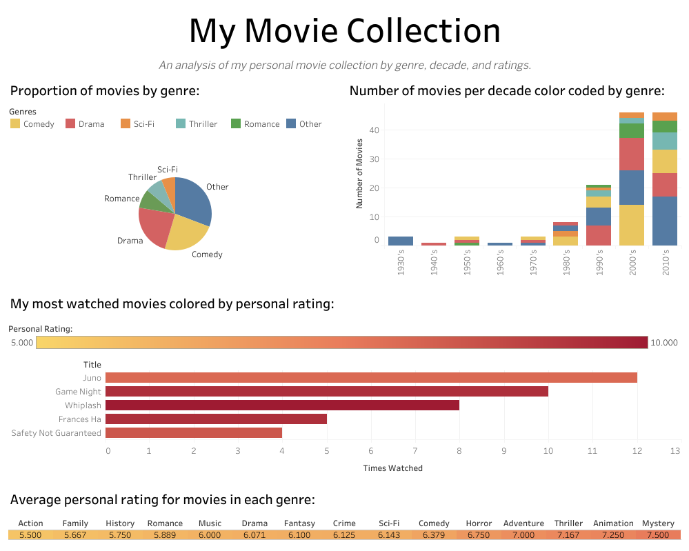

# Movie Collection Dashboard 

##  Project Overview
This project analyzes my personal movie collection using **PostgreSQL for data storage**, **SQL for querying**, and **Tableau for visualization**. The dataset tracks movies by **genre, decade, watch count, and personal ratings**. 

## Key Features
**PostgreSQL database schema** for storing movie data  
**SQL queries** for data transformation and exporting to Tableau  
**Tableau dashboard** with interactive visualizations  
**Data cleaning and normalization** (multi-genre movies linked via a junction table)

## Files Included
 `data/`
- **movies_schema.sql** → PostgreSQL schema to create tables  
- **movies_data_sample.csv** → A sample dataset for testing  

 `sql_queries/`
- **create_tables.sql** → SQL script to create tables  
- **insert_sample_data.sql** → Sample data insertions  
- **export_query.sql** → Query used to export data for Tableau  

 `tableau/`
- **dashboard_screenshot.png** → Image preview of the Tableau dashboard  
- **tableau_workbook.twbx** → Packaged Tableau workbook  

##  Technologies Used
- **PostgreSQL** (Database)
- **SQL** (Data querying & transformation)
- **Tableau** (Data visualization)
- **GitHub** (Version control)

##  Tableau Dashboard
[View the Dashboard on Tableau Public](https://public.tableau.com/app/profile/daniel.gray.carson/viz/Book1_17378366146060/Dashboard12?publish=yes)  
(Screenshot below)  

##  How to Use
###  1. Set Up the Database
1. Install **PostgreSQL** and create a database.
2. Run `data/movies_schema.sql` to create tables.
3. Load sample data using `sql_queries/insert_sample_data.sql`.

###  2. Explore the Data
- Use `sql_queries/export_query.sql` to extract the dataset for Tableau.
- Open the `.csv` file in **Tableau** and build visualizations.

###  3. Modify and Extend
Feel free to **add your own movies**, modify the SQL queries, or create additional visualizations in Tableau!

##  Contact & Feedback
If you have any questions, feel free to connect with me on **LinkedIn** or **GitHub Discussions**.
